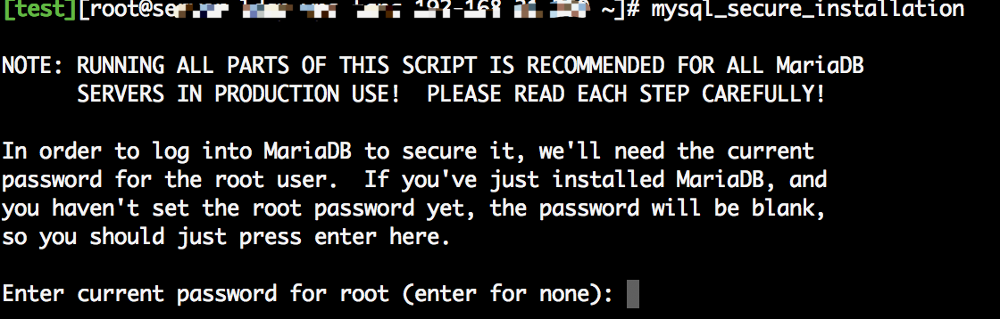
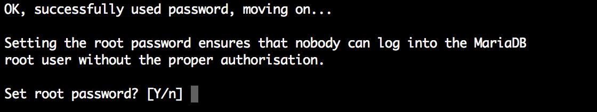
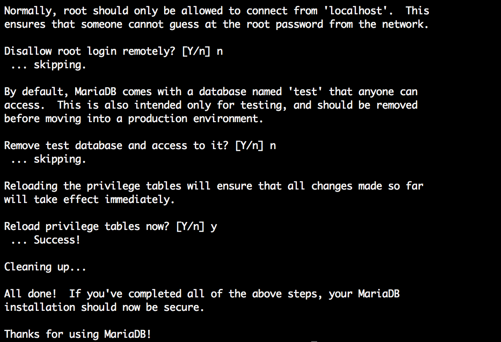
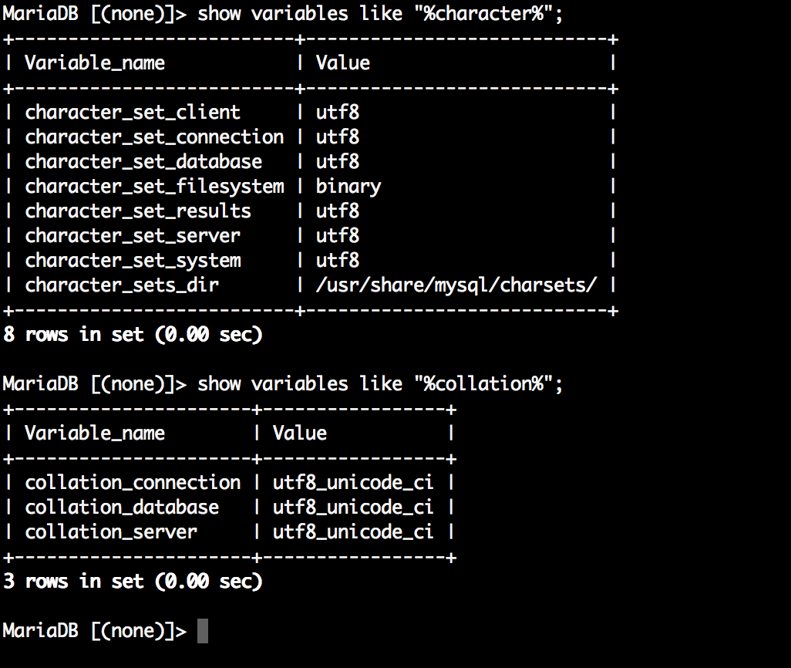
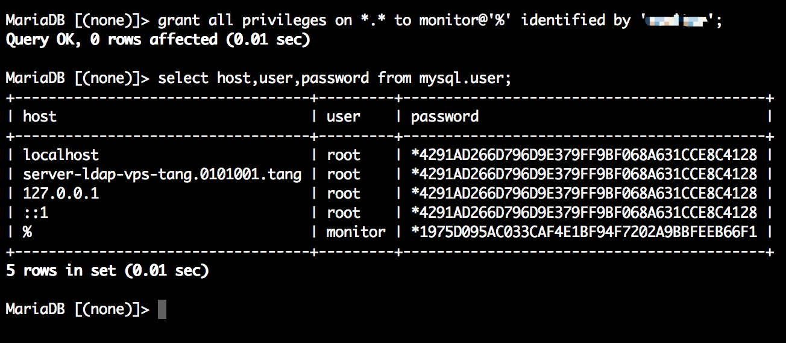
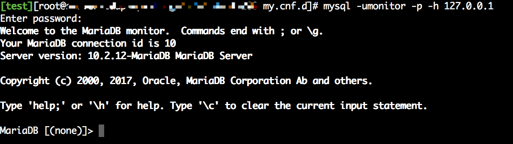

# Centos下yum安装Mariadb 

操作系统版本：CentOS Linux release 7.4.1708 (Core) 

数据库版本：[10.2.12](https://downloads.mariadb.org/mariadb/10.2.12/)

Mariadb 版本选择：https://downloads.mariadb.org/mariadb/+releases

Linux下安装MariaDB官方文档参见：https://mariadb.com/kb/en/library/yum


#### 1.添加Mariadb yum源

系统及版本选择：<https://downloads.mariadb.org/mariadb/repositories/#mirror=tuna>

```shell
sudo vi /etc/yum.repos.d/MariaDB.repo
```

插入以下内容

```shell
# MariaDB 10.2 CentOS repository list - created 2018-04-16 03:24 UTC
# http://downloads.mariadb.org/mariadb/repositories/
[mariadb]
name = MariaDB
baseurl = http://yum.mariadb.org/10.2.12/centos7-amd64
gpgkey=https://yum.mariadb.org/RPM-GPG-KEY-MariaDB
gpgcheck=1
```

注：`baseurl = http://yum.mariadb.org/10.2.12/centos7-amd64`我这里指定了安装版本 `10.2.12`，默认安装最新。原配置信息`baseurl = <http://yum.mariadb.org/10.2/centos7-amd64>`

添加Mariadb签名的密钥

```shell
sudo rpm --import https://yum.mariadb.org/RPM-GPG-KEY-MariaDB
```


#### 2.运行安装命令安装MariaDB

```shell
sudo yum install MariaDB-server MariaDB-client
```

首先下载安装包，然后进行自动安装，安装成功之后启动MariaDB服务。

```shell
#centos 6
service mysql start #启动服务
chkconfig mysql on #设置开机启动
service mysql stop #停止服务

#centos 7
systemctl start mariadb #启动服务
systemctl enable mariadb #设置开机启动
systemctl restart mariadb #重新启动
systemctl stop mariadb.service #停止MariaDB
```

#### 3.登录到数据库

用mysql -uroot命令登录到MariaDB，此时root账户的密码为空。

#### 4.进行MariaDB的相关简单配置

使用mysql_secure_installation命令进行配置。　　

因原始密码为空，直接回车设置root账户的密码



输入两次密码　　

其他配置：是否删除匿名用户、是否允许远程登录、 是否删除test数据库、是否重新加载权限表，根据自己环境的需要选择 [Y/n] 后回车。




#### 5.配置MariaDB的字符集

查看/etc/my.cnf文件内容，其中包含一句!includedir /etc/my.cnf.d 说明在该配置文件中引入/etc/my.cnf.d 目录下的配置文件。

　　1）使用vi server.cnf命令编辑server.cnf文件，在[mysqld]标签下添加

```shell
init_connect='SET collation_connection = utf8_unicode_ci'
init_connect='SET NAMES utf8'
character-set-server=utf8
collation-server=utf8_unicode_ci
skip-character-set-client-handshake
```

　　如果/etc/my.cnf.d 目录下无server.cnf文件，则直接在/etc/my.cnf文件的[mysqld]标签下添加以上内容。

　　2）用vi  client.cnf命令编辑/etc/my.cnf.d/client.cnf文件，在[client]标签下添加 

```shell
default-character-set=utf8
```

　　3）用vi  mysql-clients.cnf命令编辑/etc/my.cnf.d/mysql-clients.cnf文件，在[mysql]标签下添加 

```shell
default-character-set=utf8
```

配置完成后 systemctl restart mariadb 重启服务。

进入到数据库查看字符设置。

```mariadb
> show variables like "%character%";
> show variables like "%collation%";
```




#### 6.添加用户，设置权限

创建本地登陆用户命令：

```mariadb
> create user username@localhost identified by 'password';
```

授予外网登陆权限：

```mariadb
> grant all privileges on *.* to username@'%' identified by 'password';
```



使用创建的新用户连接数据库



成功登陆，完成！