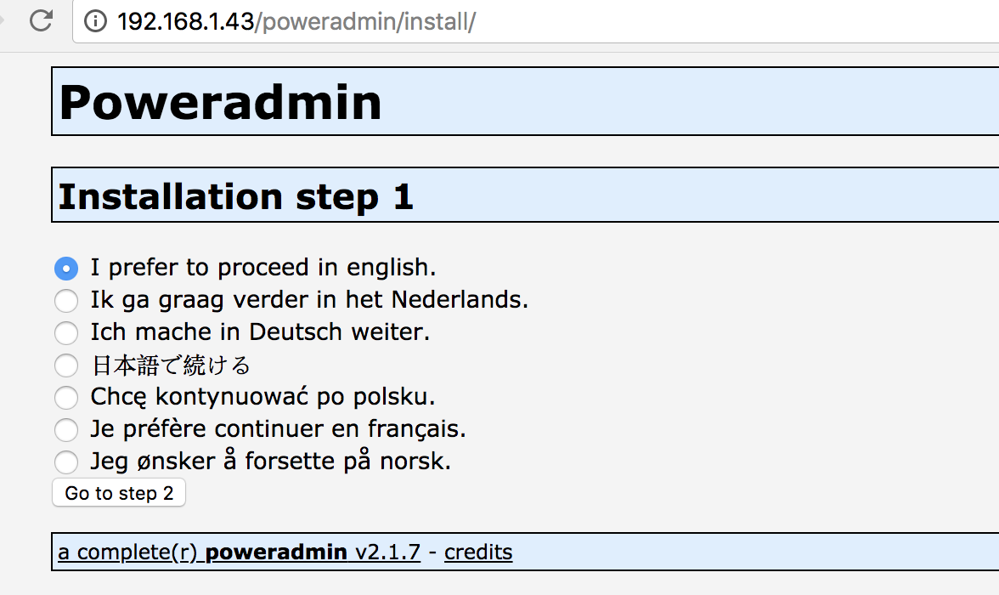
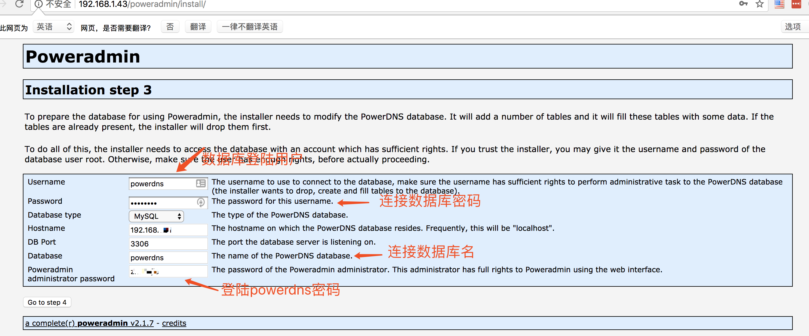
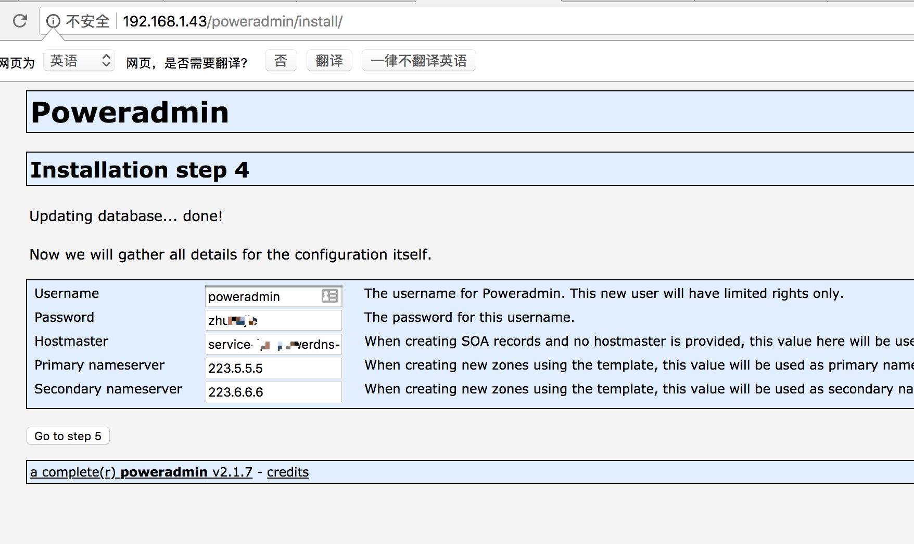
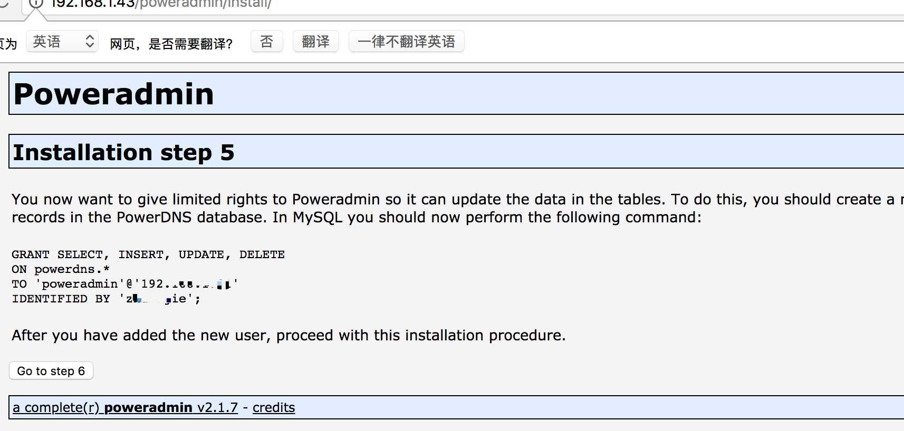
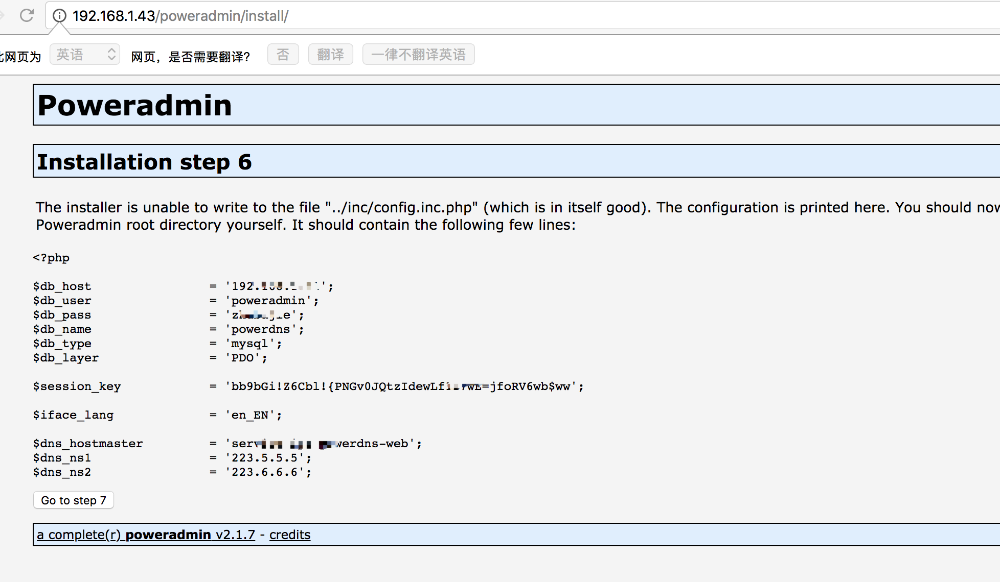
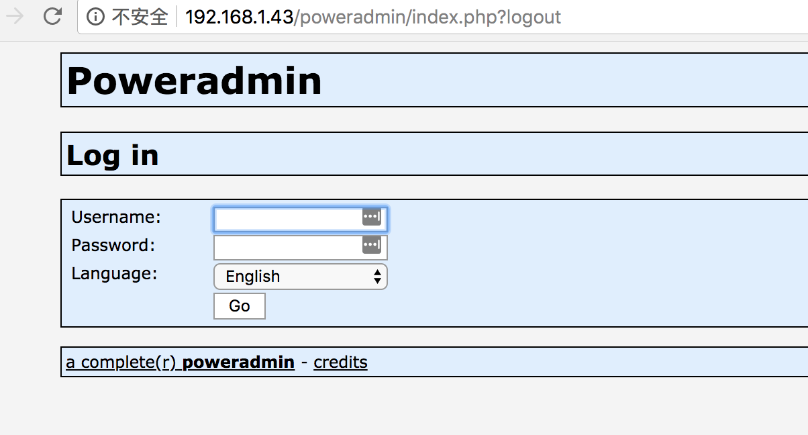

# Centos下PowerDNS搭建

操作系统：CentOS release 6.9  

ip地址：192.178.1.43

软件版本：pdnsutil 4.0.5

#### 安装MySQL

安装教程见：[Centos 下yum 安装Mariadb](https://blog.yagetang.cn/db/Centos%E4%B8%8Byum%E5%AE%89%E8%A3%85Mariadb.html)

使用aliyun 源 

> ```
> # wget -O /etc/yum.repos.d/CentOS-Base.repo http://mirrors.aliyun.com/repo/Centos-6.repo
> ```

#### 安装PowerDNS

#### 获取powerdns源

> ```
> # curl -o /etc/yum.repos.d/powerdns-auth-40.repo https://repo.powerdns.com/repo-files/centos-auth-40.repo
>
>   % Total    % Received % Xferd  Average Speed   Time    Time     Time  Current
>                                  Dload  Upload   Total   Spent    Left  Speed
> 111   559  111   559    0     0     80      0  0:00:06  0:00:06 --:--:--  1774
> # yum -y install pdns pdns-backend-mysql
> ```

#### 配置PowerDNS

PowerDNS的配置文件位于/etc/pdns/pdns，在编辑之前，我们将为PowerDNS服务配置一个MariaDB数据库。首先，我们将连接到MariaDB服务器并创建一个名为powerdns的数据库：

> ```
> MariaDB [mysql]> CREATE DATABASE powerdns;
> Query OK, 1 row affected (0.00 sec)
>
> MariaDB [mysql]> GRANT ALL ON powerdns.* TO 'powerdns'@'%' IDENTIFIED BY '你的密码';
> Query OK, 0 rows affected (0.01 sec)
>
> MariaDB [mysql]> flush privileges;
> Query OK, 0 rows affected (0.00 sec)
> ```

8,我们继续创建PowerDNS要使用的数据库表。像堆积木一样执行以下这些：

> ```
> use powerdns;
>
> CREATE TABLE domains (
>   id                    INT AUTO_INCREMENT,
>   name                  VARCHAR(255) NOT NULL,
>   master                VARCHAR(128) DEFAULT NULL,
>   last_check            INT DEFAULT NULL,
>   type                  VARCHAR(6) NOT NULL,
>   notified_serial       INT DEFAULT NULL,
>   account               VARCHAR(40) DEFAULT NULL,
>   PRIMARY KEY (id)
> ) Engine=InnoDB;
>
> CREATE UNIQUE INDEX name_index ON domains(name);
>
>
> CREATE TABLE records (
>   id                    BIGINT AUTO_INCREMENT,
>   domain_id             INT DEFAULT NULL,
>   name                  VARCHAR(255) DEFAULT NULL,
>   type                  VARCHAR(10) DEFAULT NULL,
>   content               VARCHAR(255) DEFAULT NULL,
>   ttl                   INT DEFAULT NULL,
>   prio                  INT DEFAULT NULL,
>   change_date           INT DEFAULT NULL,
>   disabled              TINYINT(1) DEFAULT 0,
>   ordername             VARCHAR(255) BINARY DEFAULT NULL,
>   auth                  TINYINT(1) DEFAULT 1,
>   PRIMARY KEY (id)
> ) Engine=InnoDB;
>
> CREATE INDEX nametype_index ON records(name,type);
> CREATE INDEX domain_id ON records(domain_id);
> CREATE INDEX recordorder ON records (domain_id, ordername);
>
> CREATE TABLE supermasters (
>   ip                    VARCHAR(64) NOT NULL,
>   nameserver            VARCHAR(255) NOT NULL,
>   account               VARCHAR(40) NOT NULL,
>   PRIMARY KEY (ip, nameserver)
> ) Engine=InnoDB;
>
> CREATE TABLE comments (
>   id                    INT AUTO_INCREMENT,
>   domain_id             INT NOT NULL,
>   name                  VARCHAR(255) NOT NULL,
>   type                  VARCHAR(10) NOT NULL,
>   modified_at           INT NOT NULL,
>   account               VARCHAR(40) NOT NULL,
>   comment               VARCHAR(1024) NOT NULL,
>   PRIMARY KEY (id)
> ) Engine=InnoDB;
>
> CREATE INDEX comments_domain_id_idx ON comments (domain_id);
> CREATE INDEX comments_name_type_idx ON comments (name, type);
> CREATE INDEX comments_order_idx ON comments (domain_id, modified_at);
>
> CREATE TABLE domainmetadata (
>   id                    INT AUTO_INCREMENT,
>   domain_id             INT NOT NULL,
>   kind                  VARCHAR(32),
>   content               TEXT,
>   PRIMARY KEY (id)
> ) Engine=InnoDB;
>
> CREATE INDEX domainmetadata_idx ON domainmetadata (domain_id, kind);
>
> CREATE TABLE cryptokeys (
>   id                    INT AUTO_INCREMENT,
>   domain_id             INT NOT NULL,
>   flags                 INT NOT NULL,
>   active                BOOL,
>   content               TEXT,
>   PRIMARY KEY(id)
> ) Engine=InnoDB;
>
> CREATE INDEX domainidindex ON cryptokeys(domain_id);
>
> CREATE TABLE tsigkeys (
>   id                    INT AUTO_INCREMENT,
>   name                  VARCHAR(255),
>   algorithm             VARCHAR(50),
>   secret                VARCHAR(255),
>   PRIMARY KEY (id)
> ) Engine=InnoDB;
>
> CREATE UNIQUE INDEX namealgoindex ON tsigkeys(name, algorithm);
>
> flush privileges;
> quit;
> ```


现在配置PowerDNS了，以MariaDB作为后台。请打开PowerDNS的配置文件：    

> ```
> # vim /etc/pdns/pdns.conf
> ```

  查找类似：#launch= ；添加下面的内容：                          

```
# launch        Which backends to launch and order to query them in
#
# launch=

launch=gmysql
gmysql-host=数据库地址
gmysql-user=powerdns
gmysql-password=你的密码
gmysql-dbname=powerdns
```

   然后保存退出。

添加开机启动项并启动

> ```
> # chkconfig pdns on
>
> # /etc/init.d/pdns start
> Starting PowerDNS authoritative nameserver: started
> ```

   到这一步，你的PowerDNS服务器已经起起并运行了。要获得更多关于PowerDNS的信息，

  你可以参考手册<http://downloads.powerdns.com/documentation/html/index.html>。

 

#### 安装PowerAdmin来管理PowerDNS

** **

安装PowerAdmin——一个界面友好的PowerDNS服务器的 Web 管理器。由于它是用PHP写的，我们将需要安装PHP和一台网络服务器（Apache）：

> ```
> # yum -y install httpd php php-devel php-gd php-mcrypt php-imap php-ldap php-mysql php-odbc php-pear php-xml php-xmlrpc php-mbstring php-mcrypt php-mhash gettext
>
> #安装完成后，我们将需要启动并设置Apache开机启动：
> # /etc/init.d/httpd start
> Starting httpd: httpd: Could not reliably determine the server's fully qualified domain name, using 220.250.64.228 for ServerName
>                                                            [  OK  ]
> # chkconfig httpd on
> ```

下载软件包。因为Apache默认的网页目录位于/var/www/html/，我们将下载软件包到这里。

> ```
> # cd  /var/www/html/
> # wget http://downloads.sourceforge.net/project/poweradmin/poweradmin-2.1.7.tgz
> # tar -zxvf poweradmin-2.1.7.tgz 
> # mv poweradmin-2.1.7 poweradmin
> ```
>
> 

启动PowerAdmin的网页安装器了，只需打开：

   http://192.168.1.43/poweradmin/install/ 

                 

  上面的页面会要求你为PowerAdmin选择语言，请选择你想要使用的那一个，

   然后点击“进入步骤 2”按钮。

安装器需要PowerDNS数据库：

      

 输入这些信息后，进入步骤 4。你将创建为Poweradmin创建一个受限用户。这里你需要输入的字段是：

  [

  用户名（Username） - PowerAdmin用户名。

  密码（Password）– 上述用户的密码。

  主机管理员（Hostmaster）- 当创建SOA记录而你没有指定主机管理员时，该值会被用作默认值(可以不写)。

  主域名服务器 - 该值在创建新的DNS区域时会被用于作为主域名服务器。

  辅域名服务器– 该值在创建新的DNS区域时会被用于作为辅域名服务器。            

 在下一步中，Poweradmin会要求你在数据库表中创建一个新的受限数据库用户，它会提供你需要在MariaDB控制台输入的代码：



现在打开终端并运行： 

   以下这段命令就是复制上图17步骤中的命令，进入数据库粘贴即可。                 

```
mysql-u root -p

GRANT SELECT, INSERT, UPDATE, DELETE
ON powerdns.*
TO 'poweradmin'@'%'
IDENTIFIED BY '密码';
```

 现在，回到浏览器中并继续下一步。安装器将尝试创建配置文件到/var/www/html/powera/inc目录下，文件名是config.inc.php。

   为防止该脚本没有写权限，你可以手动复制这些内容，手动创建上述文件中：



现在，进入最后页面，该页面会告知你安装已经完成以及如何访问安装好的PowerAdmin：

 

​    你可以通过运行以下命令来启用用于其他动态DNS提供商的URL：

​     cp install/htaccess.dist.htaccess

​    出于该目的，你将需要在Apache的配置中启用mod_rewrite。

 现在，需要移除从PowerAdmin的根目录中移除“install”文件夹，这一点很重要。使用以下命令：

   rm -rf /var/www/html/poweradmin/install/

   在此之后，你可以通过以下方式访问PowerAdmin：

   http://192.168.1.43/poweradmin/



   在登录后，你应该会看到PowerAdmin的主页：

遇到 的问题：

未安装 install PHP mcrypt extension!

解决办法：

yum安装

添加源

> ```
> #mirrorlist
>
> [epel]
> name=Extra Packages for Enterprise Linux 6 - $basearch
> baseurl=http://download.fedoraproject.org/pub/epel/6/$basearch
> #mirrorlist=https://mirrors.fedoraproject.org/metalink?repo=epel-6&arch=$basearch
> failovermethod=priority
> enabled=1
> gpgcheck=1
> gpgkey=file:///etc/pki/rpm-gpg/RPM-GPG-KEY-EPEL-6
> ```


安装：

> ```
> # yum install libmcrypt libmcrypt-devel mcrypt mhash php-mcrypt
> # php -m |grep mcrypt
> mcrypt
> # /etc/init.d/httpd restart
> ```

参考原文地址：http://506554897.blog.51cto.com/2823970/1956635

