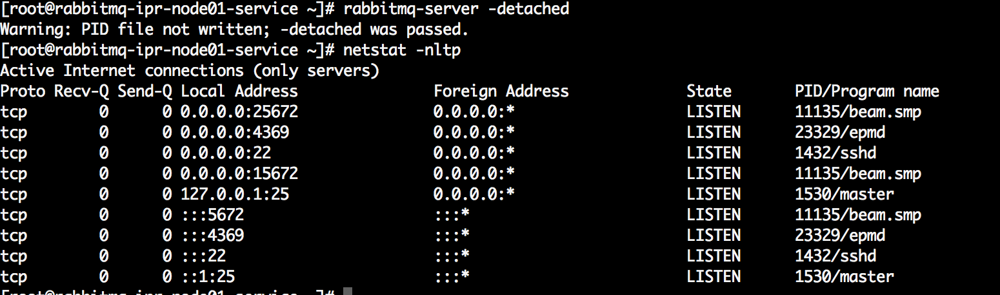
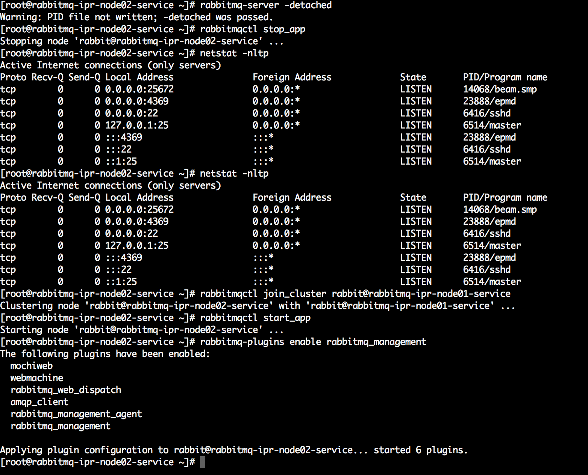
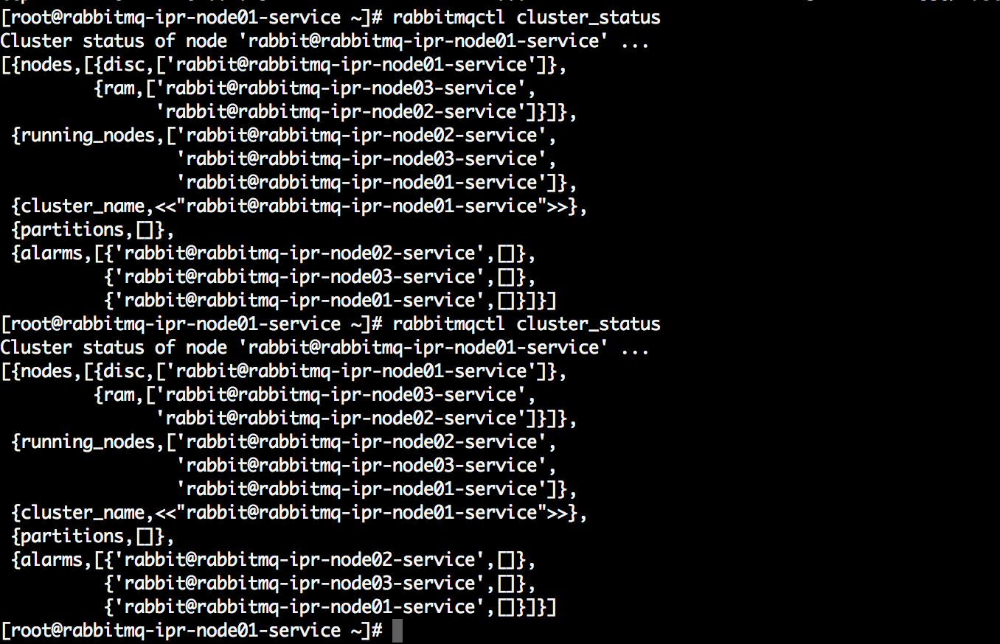
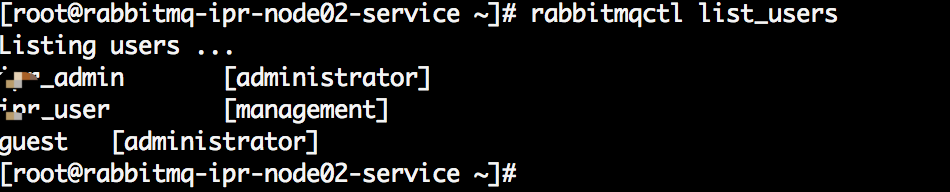
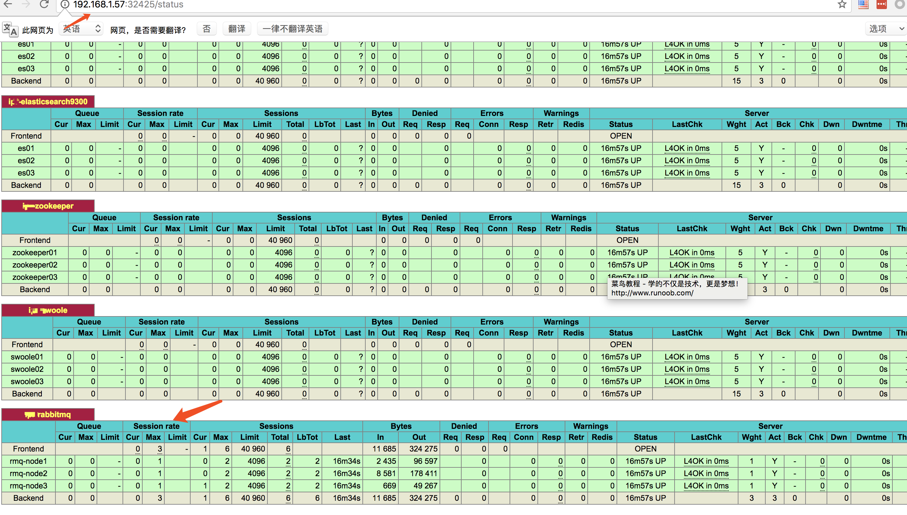
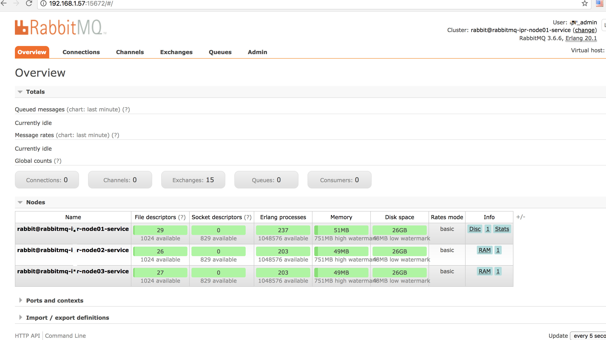

# Centos下高可用RabbbitMQ安装

版本

RabbitMQ 3.6.6, Erlang 20.1

主机

192.168.1.76 rabbitmq-ops-node01-service

192.168.1.44 rabbitmq-ops-node02-service

192.168.1.52 rabbitmq-ops-node03-service

192.168.1.57 haproxy 服务器

包下载地址：https://dl.bintray.com/rabbitmq/all/rabbitmq-server/

安装

> ```shell
> # yum install rabbitmq-server-3.6.6-1.el6.noarch.rpm 
> ```
>
> 

启动服务

> ```shell
> /etc/init.d/rabbitmq-server start
> ```

添加管理账号

> ```shell
> # rabbitmqctl add_user ops_admin xxxxxx
> Creating user "ops_admin" ...
> # rabbitmqctl set_user_tags ops_admin administrator
> Setting tags for user "ops_admin" to [administrator] ...
> # rabbitmqctl  set_permissions -p /  ops_admin '.*' '.*' '.*'
> Setting permissions for user "ops_admin" in vhost "/" ...
> ```
>

开启web远程

> ```shell
> # rabbitmq-plugins list #查看支持的插件
> .........
> [  ] rabbitmq_management               3.6.6 #使用此插件实现 web 管理
> .........
> # rabbitmq-plugins enable rabbitmq_management #启动插件
> The following plugins have been enabled:
>   mochiweb
>   webmachine
>   rabbitmq_web_dispatch
>   amqp_client
>   rabbitmq_management_agent
>   rabbitmq_management
>
> Applying plugin configuration to rabbit@rabbitmq-ops-node01-service... started 6 plugins.
> ```
>
> 

列出用户信息

> ```shell
> # rabbitmqctl list_users
> Listing users ...
> ops_admin	[administrator]
> guest	[administrator]
> ```
>

创建虚拟目录

> ```Shell
> # rabbitmqctl add_vhost /ops
> ```


添加业务账号

> ```shell
> # rabbitmqctl add_user ops_user xxxxxx
> Creating user "ops_user" ...
> # rabbitmqctl set_user_tags ops_user management
> Setting tags for user "ops_user" to [administrator] ...
> # rabbitmqctl  set_permissions -p /ops  ops_user '.*' '.*' '.*'
> Setting permissions for user "ops_user" in vhost "/" ...
> ```


查看目录

> ```
>
> # rabbitmqctl list_user_permissions ops_admin
> Listing permissions for user "ops_admin" ...
> /	.*	.*	.*
>
> ```

指定配置文件 

> ```shell
> # cp  /usr/share/doc/rabbitmq-server-3.6.6/rabbitmq.config.example /etc/rabbitmq/rabbitmq.config
> # /etc/init.d/rabbitmq-server reload
> Restarting rabbitmq-server: SUCCESS
> rabbitmq-server.
> ```


#### 集群配置

RabbitMQ利用erlang的分布式特性组建集群，erlang集群通过magic cookie实现，此cookie保存在$home/.erlang.cookie，这里即：/var/lib/rabbitmq/.erlang.cookie，需要保证集群各节点的此cookie一致，可以选取一个节点的cookie，采用scp同步到其余节点。

### 1. 同步cookie

```shell
#注意.erlang.cookie文件的权限，rabbitmq账号，权限400或600即可，为组或other账号赋权会报错
[root@rabbitmq-ops-node01-service ~]# scp /var/lib/rabbitmq/.erlang.cookie root@192.168.1.44:/var/lib/rabbitmq/
[root@rabbitmq-ops-node01-service ~]# scp /var/lib/rabbitmq/.erlang.cookie root@192.168.1.52:/var/lib/rabbitmq/
```

### 2. 配置hosts

```shell
#组建集群时采用”cluster@node”的格式，需要提前设置hosts文件；
#rmq-node2/3配置相同
[root@rabbitmq-ops-node01-service ~]# echo -e "192.168.1.76 rabbitmq-ops-node01-service\n192.168.1.44 rabbitmq-ops-node02-service\n192.168.1.52 rabbitmq-ops-node03-service" >> /etc/hosts


```

### 3. 使用-detached参数启动节点

```
#rmq-node2/3因更换了.erlang.cookie，使用此命令会无效并报错，可以依次采用“systemctl stop rabbitmq-server”停止服务，“systemctl start rabbitmq-server”启动服务，最后再“rabbitmqctl stop”
[root@rabbitmq-ops-node01-service ~]# rabbitmqctl stop
[root@rabbitmq-ops-node01-service ~]# rabbitmq-server -detached
```



### 4. 组建集群（rmq-node2&rmq-node3）

#### 1）组建集群（disk节点）

```
#“rabbitmqctl join_cluster rabbit@rabbitmq-ops-node01-service”中的“rabbit@rabbitmq-ops-node01-service”，rabbit代表集群名，rabbitmq-ops-node01-service代表集群节点；rabbitmq-ops-node02-service与rabbitmq-ops-node03-service均连接到rabbitmq-ops-node01-service，它们之间也会自动建立连接。
#如果需要使用内存节点，增加一个”--ram“的参数即可，如“rabbitmqctl join_cluster --ram rabbit@rabbitmq-ops-node01-service”，一个集群中至少需要一个”disk”节点 
[root@rabbitmq-ops-node02-service ~]# rabbitmqctl stop_app
[root@rabbitmq-ops-node02-service ~]# rabbitmqctl join_cluster rabbit@rabbitmq-ops-node01-service
[root@rabbitmq-ops-node02-service ~]# rabbitmqctl start_app
[root@rabbitmq-ops-node02-service ~]# rabbitmq-plugins enable rabbitmq_management

[root@rabbitmq-ops-node03-service ~]# rabbitmqctl stop_app
[root@rabbitmq-ops-node03-service ~]# rabbitmqctl join_cluster rabbit@rabbitmq-ops-node01-service
[root@rabbitmq-ops-node03-service ~]# rabbitmqctl start_app
[root@rabbitmq-ops-node03-service ~]# rabbitmq-plugins enable rabbitmq_management
```



#### 2）修改disk节点到内存节点 

```shell
#如果节点已是"disk"节点，可以修改为内存节点
[root@rabbitmq-ops-node02-service ~]# rabbitmqctl stop_app
Stopping node 'rabbit@rabbitmq-ops-node02-service' ...
[root@rabbitmq-ops-node02-service ~]# rabbitmqctl change_cluster_node_type ram
Turning 'rabbit@rabbitmq-ops-node02-service' into a ram node ...
[root@rabbitmq-ops-node02-service ~]# rabbitmqctl start_app
Starting node 'rabbit@rabbitmq-ops-node02-service' ...
```

### 5. 查看集群状态

```
[root@rmq-node1 ~]# rabbitmqctl cluster_status
```



1. 3个节点正常运行，其中node2/3是内存节点；
2. 另外节点间的元数据也会同步，如前文只在node1节点创建的admin账号，此时也可在其他两个节点查询；



注：但节点间的配置文件不会同步，如前文在node1节点允许的guest账号远程登录，此时其他节点的guest账号并不具备登录权限。

### 6. 设置镜像队列高可用

到目前为止，集群虽然搭建成功，但只是默认的普通集群，exchange，binding等数据可以复制到集群各节点。

但对于队列来说，各节点只有相同的元数据，即队列结构，但队列实体只存在于创建改队列的节点，即队列内容不会复制（从其余节点读取，可以建立临时的通信传输）。

这样此节点宕机后，其余节点无法从宕机节点获取还未消费的消息实体。如果做了持久化，则需要等待宕机节点恢复，期间其余节点不能创建宕机节点已创建过的持久化队列；如果未做持久化，则消息丢失。

```
rabbitmqctl set_policy [-p Vhost] Name Pattern Definition [Priority]

-p Vhost： 可选参数，针对指定vhost下的queue进行设置
Name: policy的名称
Pattern: queue的匹配模式(正则表达式)
Definition：镜像定义，包括三个部分ha-mode, ha-params, ha-sync-mode
    ha-mode:指明镜像队列的模式，有效值为 all/exactly/nodes
        all：表示在集群中所有的节点上进行镜像
        exactly：表示在指定个数的节点上进行镜像，节点的个数由ha-params指定
        nodes：表示在指定的节点上进行镜像，节点名称通过ha-params指定
    ha-params：ha-mode模式需要用到的参数
    ha-sync-mode：进行队列中消息的同步方式，有效值为automatic和manual
priority：可选参数，policy的优先级12345678910111213
```

例如，对队列名称以“queue_”开头的所有队列进行镜像，并在集群的两个节点上完成进行，policy的设置命令为：

```
rabbitmqctl set_policy --priority 0 --apply-to queues mirror_queue "^queue_" 
```

```shell
#任意节点执行均可如下命令：将所有队列设置为镜像队列，即队列会被复制到各个节点，各个节点状态保持一直；
#可通过命令查看：rabbitmqctl list_policies；
[root@rabbitmq-ops-node01-service ~]# rabbitmqctl set_policy ha-all "^" '{"ha-mode":"all"}'  #/目录
Setting policy "ha-all" for pattern "^" to "{\"ha-mode\":\"all\"}" with priority "0" ...
[root@rabbitmq-ops-node01-service ~]# rabbitmqctl list_policies  #查看策略
Listing policies ...
/	ha-all	all	^	{"ha-mode":"all"}	0
[root@rabbitmq-ops-node01-service ~]# rabbitmqctl set_policy -p  /ops ha-all "^"  '{"ha-mode":"all"}' #/ops目录
```

## 四．设置Haproxy

### 1. haproxy.cfg

```
#这里只给出针对rabbit_cluster的监控配置，global与default配置请见：
[root@haproxy-1 ~]# vim /usr/local/haproxy/etc/haproxy.cfg
listen RabbitMQ_Cluster
    #监控模式
    mode tcp
    #负载均衡模式
    balance roundrobin

    #访问端口
    bind 0.0.0.0:5672

    #后端服务器检测
    server rmq-node1 192.168.1.76:5672 check inter 2000 rise 2 fall 3
    server rmq-node2 192.168.1.44:5672 check inter 2000 rise 2 fall 3
    server rmq-node3 192.168.1.52:5672 check inter 2000 rise 2 fall 3
    
```

### 2. 效果验证





## 五．注意事项与遇到的问题

1. cookie在所有节点上必须完全一样，同步时注意；
2. erlang是通过主机名来连接服务，必须保证各个主机名之间可以ping通，可以通过编辑/etc/hosts来手工添加主机名和IP对应关系，如果主机名ping不通，rabbitmq服务启动会失败；
3. 如果queue是非持久化queue，则如果创建queue的那个节点失败，发送方和接收方可以创建同样的queue继续运作；如果是持久化queue，则只能等创建queue的那个节点恢复后才能继续服务。
4. 在集群元数据有变动的时候需要有disk node在线，但是在节点加入或退出时，所有的disk node必须全部在线；如果没有正确退出disk node，集群会认为这个节点宕掉了，在这个节点恢复之前不要加入其它节点。


配置文件请参考：<https://www.rabbitmq.com/configure.html#configuration-file>

