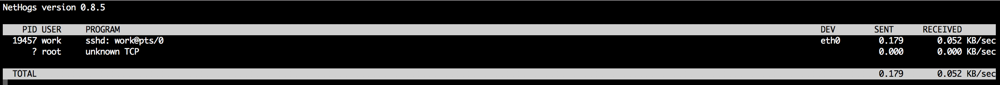
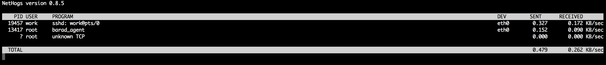

# linux利用nethogs查看某进程的网卡流量

一、nethogs介绍

　　分享一个linux 下检测系统进程占用带宽情况的检查。来自github上的开源工具。

　　它不依赖内核中的模块。当我们的服务器网络异常时，可以通过运行nethogs程序来检测是那个程序占用了大量带宽。节省了查找时间。

二、安装方法

1.在epel 源中可以直接yum 安装

```shell
yum install libpcap nethogs -y
```

2.源码方式安装

　　2.1 安装c++ 环境　　

```shell
[root@base-ops ~]# yum install gcc-c++ libpcap-devel.x86_64 libpcap.x86_64 ncurses*
```

　　2.2 下载编译好的二进制文件

```shell
[root@base-ops ~]# git clone https://github.com/raboof/nethogs
Initialized empty Git repository in /root/nethogs/.git/
remote: Counting objects: 1193, done.
remote: Total 1193 (delta 0), reused 0 (delta 0), pack-reused 1193
Receiving objects: 100% (1193/1193), 1.22 MiB | 29 KiB/s, done.
Resolving deltas: 100% (789/789), done.
```

　　2.3 编译并安装

```shell
[root@base-ops ~]# cd nethogs/

[root@base-ops nethogs]# make
[root@base-ops nethogs]# make install
```

　　完成上面步骤就算安装完成了。如果编译失败的话，大部分是缺少编译环境。

3.使用方法

3.1 直接运行nethogs 就可以查看当前占用带宽的进程



3.2 我们来测试 找出eth0 上占用大量带宽的程序

　　nethogs 网卡设备

　　我们检测 eth0，运行一下命令

```shell
[root@base-ops ~]# nethogs eth0
```



在PID 那一列，可以使用 lsof -p  pid 查看进程测试。

或者用lsof -i :端口号，来查看是哪些进程在占用。如查看80端口  lsof -i :80