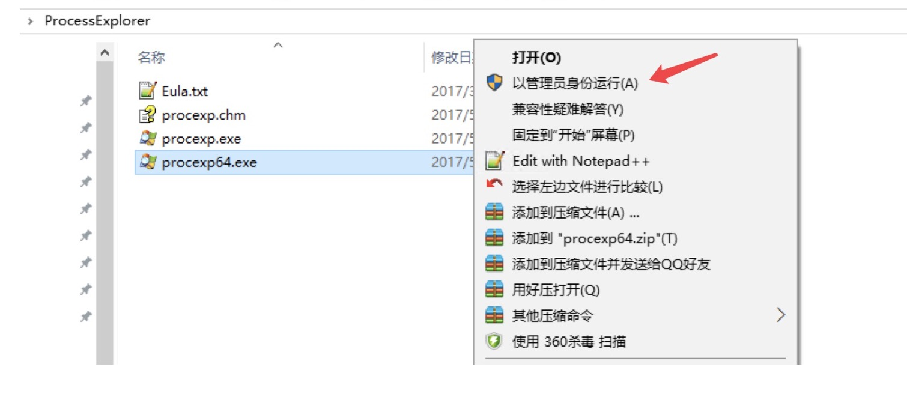
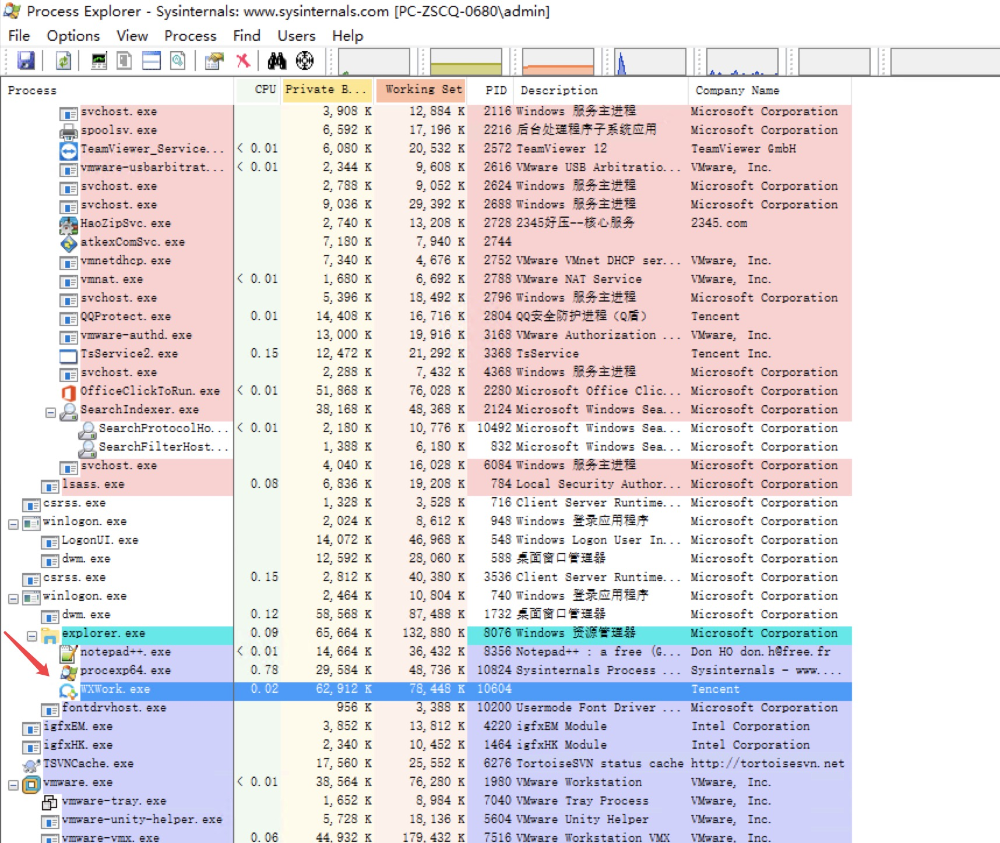
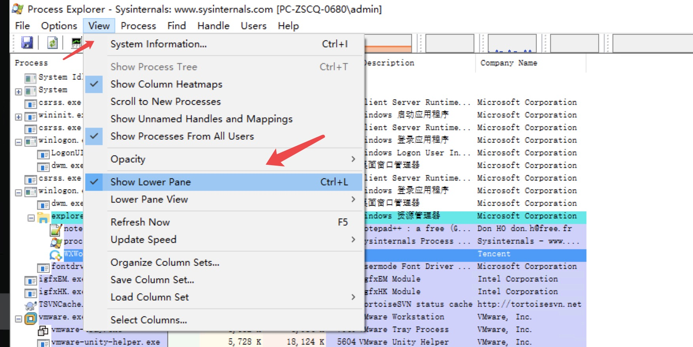
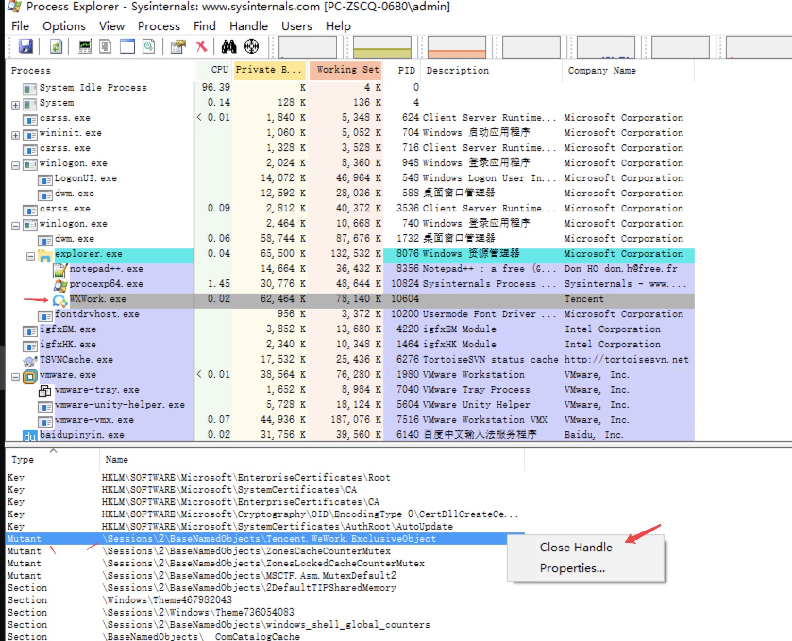

# Windows 开启多个企业微信的方法

客方解答windows下企业微信只能登录一个企业微信账号，如要实现同时开启多个，方法如下：

原理：操作系统上有两类锁，一类是进程内可见的，一类是跨进程可见的。 应用程序想做单实例运行， 是利用了后者， 声明一个跨进程可见的锁（互斥量Mutex）。 第二个程序启动时检测是否有这个锁的存在， 如果有就退出，如果没有就正常启动。

######  1.  开启一个企业微信，登陆与不登陆都可以

###### 2. 下载微软的增强版资源管理器:[Process Explorer - Windows Sysinternals](https://docs.microsoft.com/zh-cn/sysinternals/downloads/process-explorer)

​        直接复制地址下载:https://download.sysinternals.com/files/ProcessExplorer.zip

###### 3. 解压缩包，根据自己的操作系统版本右击用管理员身份运行，如下图

###### 4. 找到WXWork，就是企业微信，如下图

###### 5. 打开Show Lower Pane显示详细信息，如下图

###### 6. 找到\Sessions\2\BaseNamedObjects\Tencent.WeWork.ExclusiveObject  右击结束该进程，如下图

###### 7. 最后， 可以打开第二个企业微信了

